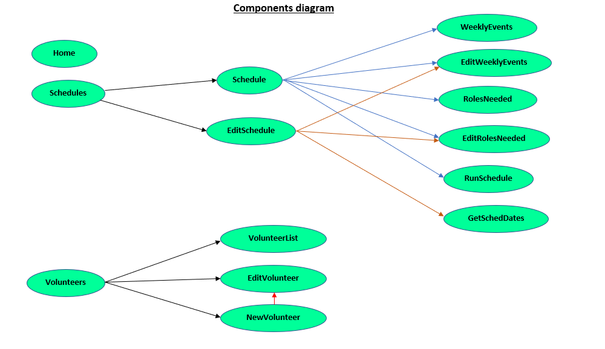

# Weekly Scheduler
Github repository: [https://github.com/MauraSlavin/scheduler](https://github.com/MauraSlavin/scheduler).  
Deployed app on Heroku: [https://pure-peak-11802.herokuapp.com/](https://pure-peak-11802.herokuapp.com/).

## Brief description

The Weekly Scheduler allows users to easily assign volunteers to positions at weekly events. 

First, a schedule is set up with start and end dates, the days of the week and start times of weekly events, the tasks volunteers are needed for, and how many of each.

Then volunteers are added with their name, email address, tasks they can do, weekly time slot, and any dates they are not available.

## User story

As a church secretary responsible for scheduling volunteers to help at the weekly Masses, I need to generate a slate of volunteer assignments for all the Masses.  I usually schedule 2-4 months at a time.

## Technologies used

- Express
- Mongo DB
- Mongoose
- Vue
- Vuetify
- Axios
- Node.js
- JavaScript
- moment.js pkg
- jsPDF pkg
- HTML & CSS

## Functionality

From the home page:

Click on Schedules to see a list of existing schedules:

You may edit an existing schedule, or set up a new schedule.  The screen for either is very similar, except you can't change the name or the date range for an existing schedule (yet).

Click the button near the top that says "Set up a new schedule" to begin creating a new schedule.

On the first page, enter a name and select beginning and ending dates.

Click the disc icon to save that and move on to choosing when the weekly events will be, and what volunteers are needed:

Now you are ready to enter volunteers!

Click on the Volunteers icon on the top right to see a list of volunteers.  You may edit or delete existing volunteers by clicking on the corresonding icon next to the volunteer's information; or add a new volunteer by clicking the large button near the top of the screen.  Note that this window has extensive ordering and sorting capabilities.

The page to edit volunteers lets you enter or edit the volunteer name, email, role they wish to volunteer for, weekly time slot, and when they are NOT available (if this is not entered, it will be assumed that they are always available during the chosen weekly event).  There are also avatars to choose from, just for fun!

Once all the volunteers are done, a slate of volunteer assignments can be generated from the list of schedules.

Here is an example of the slate generated.  Clicking the area indicated will create a PDF and put it in your Downloads folder.

## Database structure

There are two tables in the database: one for Schedules, and one for Volunteers.

Schedules:
- _id: unique Mongo id
- name: String, required, unique  -  name of schedule
- startDate: String, required  -  beginning date of schedule
- endDate: String, required  -  ending date of schedule
- version: Number, default is 0  -  append to PDF filename (not currently being used)
- roles:   array of:  -  tasks needed for this event
  - _id: unique Mongo id
  - roleName: String, required  -  name of task
  - numberNeeded: Number, default is 1  -  how many are needed at each event
- weeklyEvents: array of:  -  when each weekly event occurs
  - _id: unique Mongo id
  - day: String, required  -  day of week (i.e. "Saturday")
  - time: String, required  -  time of day (i.e. "17:15" for 5:15pm)

Volunteers:
- _id: unique Mongo id
- firstName: String, required  -  first name of volunteer
- lastName: String, required  -  last name of volunteer
- (firstName & lastName combination is unique)
- email: mongoose.SchemaTypes.Email  -  email of volunteer
- image: String  -  name of file where avatar jpg file can be found
- roles: array of:  -  task volunteer signs up for
    - Strings
- prefTimes: array of:  -  time slot volunteer signs up for
  - _id: unique Mongo id
  - day: String, required  -  day of week (i.e. "Saturday")
  - time: String, required  // time of weekly event  -  time of day (i.e. "17:15")
  - percentPreferred: Number between 0 and 100, required, default 100  -  (not being used, yet)
  - with: array of:  -  who to schedule with (not used, yet)
    - ObjectId: (of volunteer to schedule with)
  - notWith: array of:  -  who to avoid scheduling with (not used, yet)
    - ObjectId: (of volunteer to schedule with)
  - notAvailable: array of:  -  dates the volunteer is not available
    - String: dates in "yyyy-mm-dd" format  (i.e. ["2020-03-21", "2020-03-22"])

## Components

Vue components used and purposes of each:

### Component name: **_Home_**
  
  Home screen giving basic directions.  User can choose to work with Volunteers or with Schedules.  
  If Schedules chosen, component "Schedules" loaded.  
  If Volunteers chose, component "Volunteers" loaded.

### Component name: **_Volunteers_**

  Components used:
  - VolunteerList
  - NewVolunteer
  - EditVolunteer
  - Used in Home component

  Displays list of volunteers with options to:
  - Create a new volunteer
  - Edit an existing volunteer  
      List of volunteers is replaced with the component to change a volunteer's information
  - Delete an existing volunteer  
      List of volunteers is replaced with the component to update a volunteer's information

### Component name: **_VolunteerList_**

  Components used:
  - (does not use other components)
  - Used in Volunteers component

  Component in Volunteers that displays the list of volunteers

### Component name: **_NewVolunteer_**

  Components used:
  - EditVolunteer
  - Used in Volunteers component

  Component in Volunteers that displays screen to enter information for a new volunteer.

### Component name: **_EditVolunteer_**

  Components used:
  - (does not use other components)
  - Used in Volunteers and NewVolunteer components

  Component in Volunteers and NewVolunteer that displays a screen to  
  edit an existing volunteer's information (for Volunteers - existing information is loaded) or  
  add a new volunteer's information (for NewVolunteer - no information is loaded).

### Component name: **_Schedules_**

  Components used:
  - Schedule
  - EditSchedule

  Displays schedules already created, if any, with options to:  
  - Set up a new schedule,  
    List of schedules is replaced with the component to name new schedule and choose dates
  - Edit weekly events for a schedule,  
    List of schedules is replaced with the component to change the weekly events information
  - Edit roles for a schedule,  
    List of schedules is replaced with the component to change the roles information
  - Delete a schedule, or
  - Create a slate of volunteers for a schedule  
    List of schedules is replaced with the component that displays the slate of volunteer assignments.
  

### Component name: **_Schedule_**

  Components used:
  - WeeklyEvents
  - EditWeeklyEvents
  - RolesNeeded
  - EditRolesNeeded
  - RunSchedule
  - Used in Schedules component

  Used in the Schedules component to display information for each individual Schedule  
  (Name, dates, weekly events, roles).  
  Has the option to generate a slate of volunteer assignments.

### Component name: **_WeeklyEvents_**

  Components used:
  - (does not use other components)
  - Used in Schedule component

  Displays the weekly events (day of week and time) in a schedule.  
  Includes button to edit those events.

### Component name: **_EditWeeklyEvents_**

  Components used:
  - (does not use other components)
  - Used in Schedule and EditSchedule component

  Displays the weekly events (day of week and time) in a schedule.  
  Allows user to add or delete weekly events, or return to just displaying them.

### Component name: **_RolesNeeded_**

  Components used:
  - (does not use other components)
  - Used in Schedule component

  Displays the roles in a schedule, and how many are needed.  
  Includes button to edit those roles.

### Component name: **_EditRolesNeeded_**

  Components used:
  - (does not use other components)
  - Used in Schedule and EditSchedule component

  Displays the roles in a schedule, and how many are needed.  
  Allows user to add or delete roles, or return to just displaying them.

### Component name: **_EditSchedule_**

  Components used:

  - GetSchedDates
  - EditWeeklyEvents
  - EditRolesNeeded
  - Used in Schedules component

  Displays components needed to create a new schedule.  
  First, GetSchedDates; then EditWeeklyEvents and EditRolesNeeded.

### Component name: **_GetSchedDates_**

  Components used:
  - (does not use other components)
  - Used in Schedules component

  Allows user to enter a name, beginning and ending dates for a new schedule.

### Component name: **_RunSchedule_**

  Components used:
  - (does not use other components)
  - Used in Schedules component

  Generates and displays a slate of volunteer assignments for a schedule.  
  Includes button to save the slate as a PDF file.
  